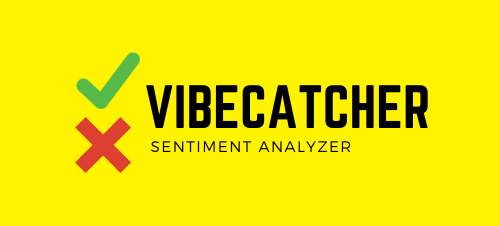
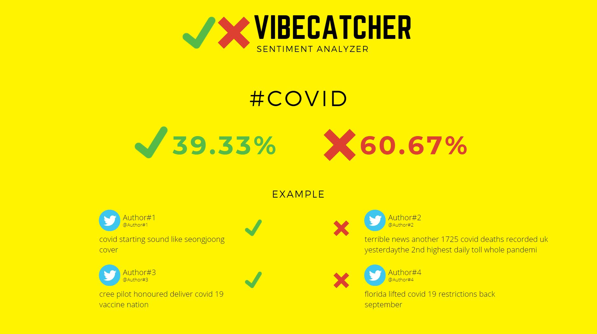
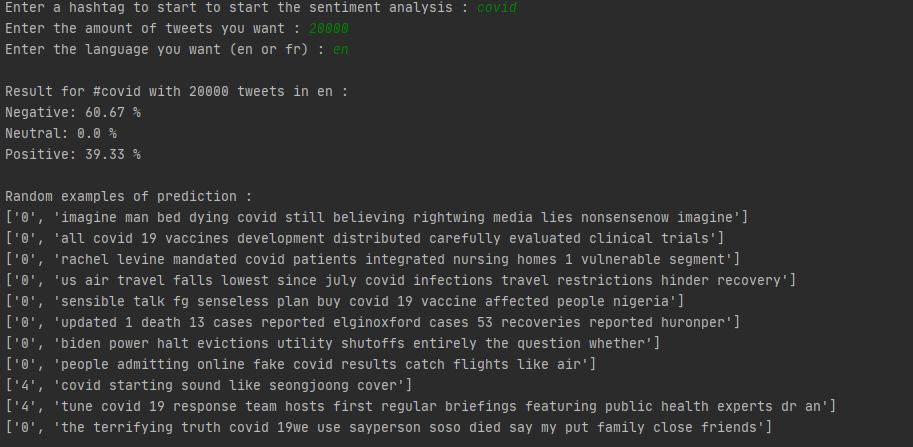

<!-- PROJECT SHIELDS -->

<!-- PROJECT LOGO -->
<br />
<p align="center">
  <a href="https://github.com/Dylane-SILVA/NLP_Vibe_Catcher">
    
  </a>

  <h3 align="center">VibeCatcher</h3>

  <p align="center">
    The aim of the Vibe Catcher project is to learn about the dominant sentiment evoked by a hashtag. From a user perspective, this will allow entering a hashtag in a search box and retrieving the general sentiment it evokes on social media Twitter and Instagram. The general sentiment will be returned under negative, neutral and positive percentage.
    <br />
    <br />
    <a href="https://github.com/Dylane-SILVA/NLP_Vibe_Catcher/issues">Report Bug</a>
    ·
    <a href="https://github.com/Dylane-SILVA/NLP_Vibe_Catcher/issues">Request Feature</a>
  </p>
</p>


<!-- TABLE OF CONTENTS -->
<details open="open">
  <summary><h2 style="display: inline-block">Table of Contents</h2></summary>
  <ol>
    <li>
      <a href="#about-the-project">About The Project</a>
      <ul>
        <li><a href="#built-with">Built With</a></li>
      </ul>
    </li>
    <li>
      <a href="#getting-started">Getting Started</a>
      <ul>
        <li><a href="#prerequisites">Prerequisites</a></li>
        <li><a href="#installation">Installation</a></li>
      </ul>
    </li>
    <li><a href="#usage">Usage</a></li>
  </ol>
</details>


<!-- ABOUT THE PROJECT -->
## About The Project

<p align="center">
  <a href="https://github.com/Dylane-SILVA/NLP_Vibe_Catcher">
    
  </a>
 </p>


The aim of the Vibe Catcher project is to learn about the dominant sentiment evoked by a hashtag. From a user perspective, this will allow entering a hashtag in a search box and retrieving the general sentiment it evokes on social media Twitter and Instagram. The general sentiment will be returned under negative, neutral and positive percentage.

From a more technical point of view, it will therefore be necessary to retrieve the user's request first, then retrieve all the posts / tweets containing it from APIs (or other means of retrieval) of social networks. Then these posts will be analyzed using machine learning, sentiment classification, and the percentages returned to the user, these percentages represent the general appreciation of people who spoke by mentioning this hashtag.


### Built With

* [Python](https://www.python.org/)


<!-- GETTING STARTED -->
## Getting Started

To get a local copy up and running follow these simple steps.

### Prerequisites

You need to get Python for run this project.

### Installation

1. Clone the repo
   ```sh
   git clone https://github.com/Dylane-SILVA/NLP_Vibe_Catcher.git
   ```
   
 2. Install core spacy
     ```sh
    python -m spacy download en_core_news_sm
    python -m spacy download fr_core_news_sm
     ```
     
 3. Run main.py
   

<!-- USAGE EXAMPLES -->
## Usage

<p align="center">
  <a href="https://github.com/Dylane-SILVA/NLP_Vibe_Catcher">
    
  </a>
</p>

- First step : you can choose a network, twitter or instagram.
- Second Step : you can choose the hashtag you want to analyse.
- Third step : you can choose the number of tweet / post you want for the analyse.
- Final step : you can choose the language between english (en) or french (fr).


## Project realised by  Alexis LIBERGE , Lin DIXUAN, Guillaume AMORTILLA, Dylane DA SILVA


<!-- MARKDOWN LINKS & IMAGES -->
<!-- https://www.markdownguide.org/basic-syntax/#reference-style-links -->
[contributors-shield]: https://img.shields.io/github/contributors/AlexisLib/NLP-VibeCatcher.svg?style=for-the-badge
[contributors-url]: https://github.com/AlexisLib/NLP-VibeCatcher/graphs/contributors
[forks-shield]: https://img.shields.io/github/forks/AlexisLib/NLP-VibeCatcher.svg?style=for-the-badge
[forks-url]: https://github.com/AlexisLib/NLP-VibeCatcher/network/members
[stars-shield]: https://img.shields.io/github/stars/AlexisLib/NLP-VibeCatcher.svg?style=for-the-badge
[stars-url]: https://github.com/AlexisLib/NLP-VibeCatcher/stargazers
[issues-shield]: https://img.shields.io/github/issues/AlexisLib/NLP-VibeCatcher.svg?style=for-the-badge
[issues-url]: https://github.com/AlexisLib/NLP-VibeCatcher/issues
[license-shield]: https://img.shields.io/github/license/AlexisLib/NLP-VibeCatcher.svg?style=for-the-badge
[license-url]: https://github.com/AlexisLib/NLP-VibeCatcher/blob/master/LICENSE.txt
[linkedin-shield]: https://img.shields.io/badge/-LinkedIn-black.svg?style=for-the-badge&logo=linkedin&colorB=555
[linkedin-url]: https://www.linkedin.com/in/alexis-l-45864611a/
